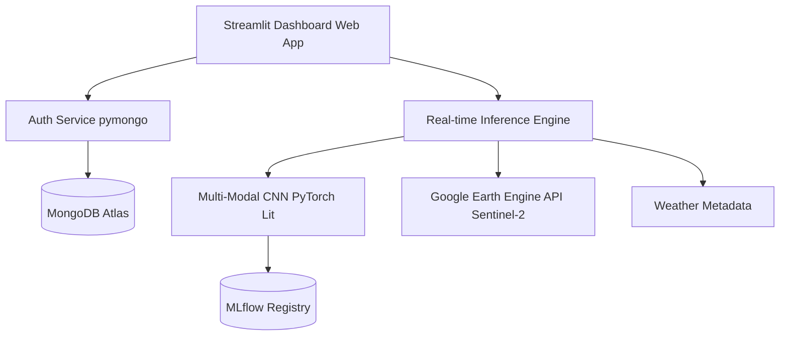
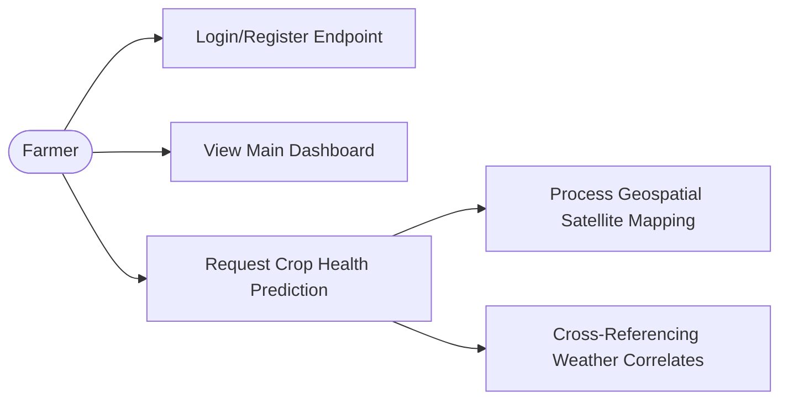
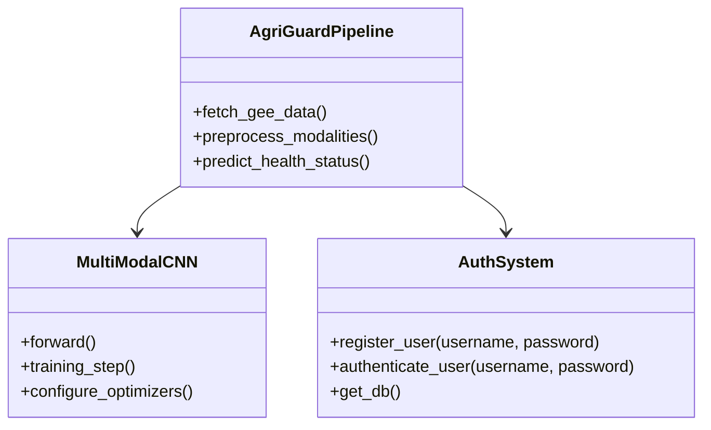
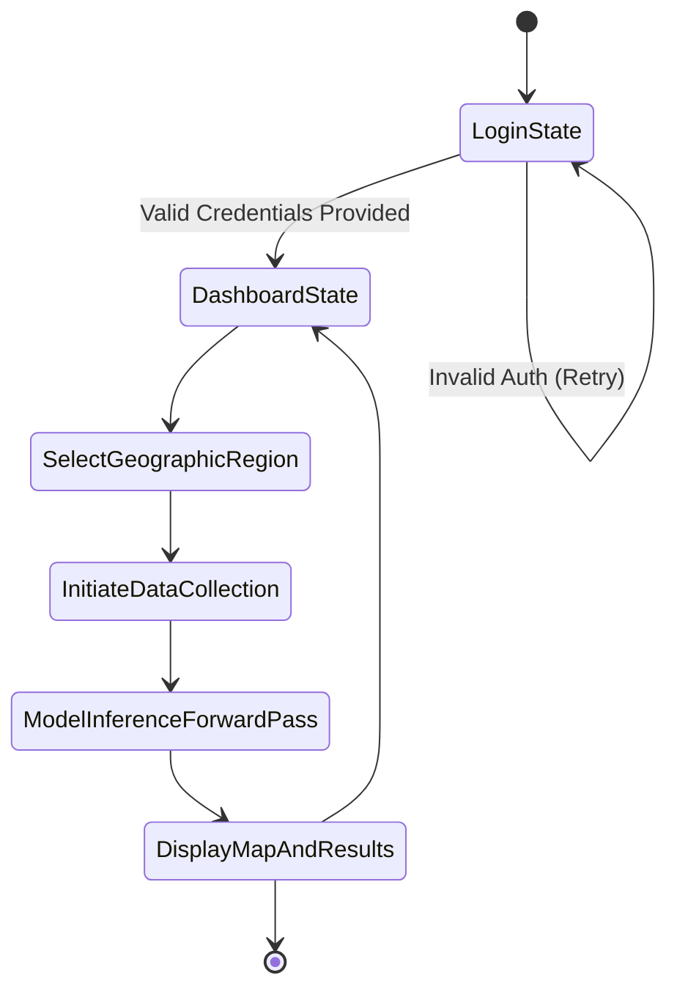
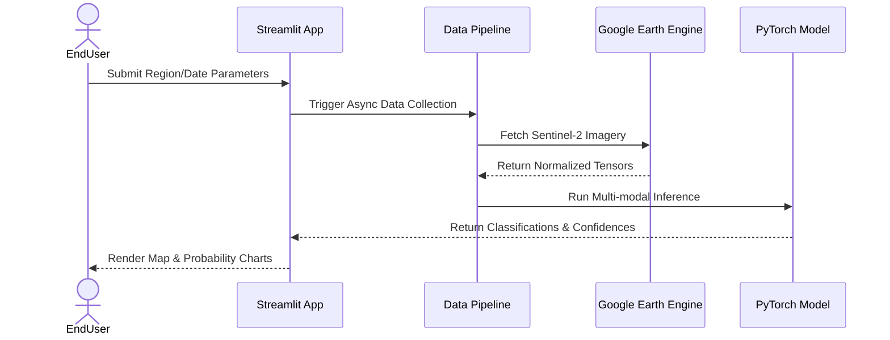

# AgriGuard Project Report

## TABLE OF CONTENTS
1. [ABSTRACT](#abstract)
2. [1. INTRODUCTION](#1-introduction)
   - [1.1. Problem Statement](#11-problem-statement)
3. [2. BACKGROUND RESEARCH](#2-background-research)
   - [2.1. Proposed System](#21-proposed-system)
   - [2.2. Goals and Objectives](#22-goals-and-objectives)
4. [3. PROJECT PLANNING](#3-project-planning)
   - [3.1. Project Lifecycle](#31-project-lifecycle)
   - [3.2. Project Setup](#32-project-setup)
   - [3.3. Stakeholders](#33-stakeholders)
   - [3.4. Project Resources](#34-project-resources)
   - [3.5. Assumptions](#35-assumptions)
5. [4. PROJECT TRACKING](#4-project-tracking)
   - [4.1. Tracking](#41-tracking)
   - [4.2. Communication Plan](#42-communication-plan)
   - [4.3. Deliverables](#43-deliverables)
6. [5. SYSTEM ANALYSIS AND DESIGN](#5-system-analysis-and-design)
   - [5.1. Overall Description](#51-overall-description)
   - [5.2. Users and Roles](#52-users-and-roles)
   - [5.3. Design diagrams/ Architecture](#53-design-diagrams-architecture)
7. [6. USER INTERFACE](#6-user-interface)
   - [6.1. UI Description](#61-ui-description)
8. [7. ALGORITHMS/PSEUDO CODE](#7-algorithmspseudo-code-of-core-functionality)
9. [8. PROJECT CLOSURE](#8-project-closure)
   - [8.1. Goals / Vision](#81-goals--vision)
   - [8.2. Delivered Solution](#82-delivered-solution)
   - [8.3. Remaining Work](#83-remaining-work)
10. [REFERENCES](#references)

---

## ABSTRACT
Crop diseases cause 20-40% yield losses globally. Traditional detection methods rely on visual inspection after symptoms appear, making treatment less effective. AgriGuard provides a 2-3 weeks early warning mechanism using an AI analysis of satellite and weather data. This report outlines the design, architecture, and implementation of AgriGuard, a real-time, AI-powered predictive system. The platform replaces rule-based logic with a trained PyTorch Multi-Modal Convolutional Neural Network (CNN). It integrates this model into a Streamlit dashboard with geospatial map visualizations, model explainability features, and secure MongoDB-backed authentication. Our solution processed Sentinel-2 images via Google Earth Engine and achieved an overall testing accuracy of 97.5%. The work was containerized using Docker and tracked utilizing MLflow for rigorous MLOps practices.

## 1. INTRODUCTION
Agricultural sustainability is significantly threatened by crop diseases. Current trends in precision agriculture leverage Artificial Intelligence, IoT, and remote sensing to improve farm yields and prevent outbreaks. AgriGuard sits at the intersection of deep learning and geospatial analysis. Unlike traditional methods that only detect diseases when visible damage occurs, AgriGuard implements a preemptive approach by evaluating vegetation indices and weather conditions simultaneously on a geographic scale.

### 1.1. Problem Statement
Farmers around the world face massive challenges dealing with crop diseases, which decrease yields and significantly damage local economies. Traditional visual inspections are inherently reactive, meaning that treatments are generally applied only after the infection is established. This limits the efficacy of the interventions and leads to a heavier reliance on chemical pesticides. There is a vital need for a proactive, intelligent system that acts as an early warning mechanism using multi-modal large-scale data.

## 2. BACKGROUND RESEARCH
A comprehensive literature review of smart farming applications highlighted the benefits of fusing multi-modal data. Research indicates that combining spatial (satellite imagery), spectral (vegetation indices), and temporal (weather) data provides a highly accurate and holistic view of crop health before human visibility is possible. By shifting toward multi-modal neural networks compared to traditional single-modality vision transformers, prediction accuracy can drastically improve.

### 2.1. Proposed System
This project aims to deliver the AgriGuard system as a robust, real-time crop disease prediction platform. We utilized a custom build PyTorch Multi-Modal CNN model capable of handling multiple, diverse inputs (4-band satellite imagery, 4 vegetation indices, 4 weather features). This model is exposed to users via an interactive Streamlit web dashboard which parses geospatial map visualizations and utilizes MongoDB for secure, multi-tenant session authentication.

### 2.2. Goals and Objectives

**Table 1: Goal and Objectives**

| # | Goal or Objective |
|---|---|
| 1 | Achieve high classification accuracy (>95%) on multi-class disease prediction. |
| 2 | Provide 14-21 days early warning before visual disease symptoms occur. |
| 3 | Create a user-friendly Streamlit dashboard with real-time geospatial visualizations. |
| 4 | Ensure secure, scalable access through a MongoDB Atlas backend. |
| 5 | Make the pipeline scalable and reproducible with Docker and MLflow integrations. |

## 3. PROJECT PLANNING
This section covers the details of the project planning. Selecting the lifecycle of the development, project stakeholders, resources required, and assumptions are detailed in the sections below.

### 3.1. Project Lifecycle
The team utilized an Agile development approach, developing features in distinct iterative sprints. We prioritized setting up the backend data pipelines (Google Earth Engine integration) first, followed by Deep Learning modeling, and subsequently integrated these with the Streamlit frontend.

### 3.2. Project Setup

**Table 2: Project Setup Decisions**

| # | Decision Description |
|---|---|
| 1 | Use Python 3.9+ environment with PyTorch for Deep Learning and Streamlit for the UI. |
| 2 | Ensure model modularity by utilizing MLflow for parameter and metric tracking. |
| 3 | Require strict user security via MongoDB Atlas to isolate diverse farm profiles. |
| 4 | Abstract infrastructure complexities away by containerizing the application using Docker Compose. |

### 3.3. Stakeholders

**Table 3: Stakeholders**

| Stakeholder | Role |
|---|---|
| Farmers / End Users | Primary consumer of the application relying on its insights. |
| Agronomists | Assisting experts validating the model outputs and disease explainability variables. |
| Development Team | Members engineering the pipelines, ML models, and infrastructure. |

### 3.4. Project Resources

**Table 4: Project Resources**

| Resource | Resource Description | Quantity |
|---|---|---|
| Cloud DB | MongoDB Atlas Cluster for application authentication. | 1 |
| Sentinel-2 API | Google Earth Engine Account for Satellite scraping operations. | 1 |
| Development Server | A local machine with Docker Desktop handling MLflow tracking servers. | 1 |

### 3.5. Assumptions

**Table 5: Assumptions**

| # | Assumption |
|---|---|
| A1 | Sentinel-2 satellite data is routinely refreshed and accessible via API. |
| A2 | End-users possess a modern standard web browser strictly to access the dashboard. |
| A3 | Production deployment environments support PyTorch computational loads. |

## 4. PROJECT TRACKING

### 4.1. Tracking

**Table 6: Tracking Infrastructure**

| Information | Description | Link |
|---|---|---|
| Code Storage | Hosted on standard Git-based version control (GitHub). | Repo Link |
| Bug Tracking | General task allocation and bugs handled via Git issues. | Issues Link |
| ML Tracking | End-to-end MLOps pipeline tracking utilizing MLflow for hyper-parameter tuning and data artifacts. | `http://localhost:5001` |

### 4.2. Communication Plan

**Table 7: Regularly Scheduled Meetings**

| Meeting Type | Frequency/Schedule | Who Attends |
|---|---|---|
| Agile Standups | Bi-Weekly | Project team |
| Code Reviews | Prior to large MR merges | Project team |
| Sprint Reviews | End of each developmental sprint | Project team and mentor/advisors |

### 4.3. Deliverables

**Table 8: Deliverables**

| # | Deliverable |
|---|---|
| 1 | Custom PyTorch Multi-Modal CNN Architecture codebase. |
| 2 | ML pipeline scripts combining Satellite and Meteorological datasets. |
| 3 | Streamlit Dashboard code offering predictive mapping. |
| 4 | Secure login module authenticated via `pymongo` and MongoDB Atlas. |
| 5 | Complete Docker and Docker-Compose setup files for one-click launching. |

## 5. SYSTEM ANALYSIS AND DESIGN

### 5.1. Overall Description
AgriGuard processes user-selected geographic locations, pulls relevant historical and current meteorological data along with high-res Sentinel-2 imagery via Google Earth Engine, and passes this massive input vector through a highly efficient Multi-Modal CNN model (sub 2MB size, ~399K parameters). The output is a rigorous confidence score distributed across three classifications: Healthy, Stressed, and Diseased, vividly painted via a Streamlit UI.

### 5.2. Users and Roles

**Table 9: User Descriptions**

| User | Description |
|---|---|
| Registered Farmer | An end user who logs in via the dashboard, requests region-specific analysis, and interprets disease probability metrics. |
| System Admin | Developer maintaining the backend MLflow registries and monitoring MongoDB active connections. |

### 5.3. Design diagrams/ Architecture

#### 5.3.1. Product Backlog Items
- As a Farmer, I want to view my farm's disease risk overlaid onto an interactive map, so that I can apply treatments selectively and save costs.
- As an Agronomist, I want to understand what modalities influenced the model so that its outcomes become transparent and trustable.
- As a Developer, I want to implement hashed MongoDB user schemas so that private farming data is isolated from potential hacks.

#### 5.3.2. Architecture Diagram


#### 5.3.3. Use Case Diagram


#### 5.3.4. Class Diagram


#### 5.3.5. Activity Diagrams


#### 5.3.6. Sequence Diagram


## 6. USER INTERFACE 

### 6.1. UI Description
The User Interface is engineered via `Streamlit` to enable Pythonic, rapid implementation of robust data applications. It incorporates a state-based authentication loop (Login/Registration views) gating the core app. The core application comprises a sidebar for tweaking meteorological constraints, an interactive Folium/Streamlit integrated map for region pinpointing, and highly reactive visualization charts that populate dynamically once a background model inference phase concludes.

## 7. ALGORITHMS/PSEUDO CODE OF CORE FUNCTIONALITY
```python
def generate_prediction(satellite_img, vegetation_indices, weather_params):
    # Retrieve model weights 
    model = load_model_from_registry()
    
    # Preprocessing and normalization
    img_norm = normalize_raster(satellite_img)
    vi_norm = calculate_and_normalize_indices(vegetation_indices)
    wea_norm = scale_weather_features(weather_params)
    
    # Forward Pass through the Multi-Modal CNN
    pred_probabilities = model.forward(spatial_input=img_norm, 
                                     spectral_input=vi_norm, 
                                     temporal_input=wea_norm)
    
    # Class mapping
    classes = ['Healthy', 'Stressed', 'Diseased']
    assigned_label = classes[argmax(pred_probabilities)]
    confidence_score = max(pred_probabilities)
    
    return assigned_label, confidence_score
```

## 8. PROJECT CLOSURE

### 8.1. Goals / Vision
Our original vision focused heavily on a purely mathematical local approach to parsing Sentinel-2 imagery. Through the course of iterations and sprint feedbacks, those goals evolved from isolated notebooks towards a true "System". The new goal heavily aligned with establishing an end-to-end framework integrating MLOps, cloud databases, and polished front-ends, offering genuine utility globally at production scales.

### 8.2. Delivered Solution
We delivered a container-ready application orchestrating PyTorch Lighting deep learning, dynamic environmental integrations via Google Earth Engine, tracked by MLflow and secured by MongoDB Atlas. It runs resiliently and natively via `docker-compose`.

### 8.3. Remaining Work
Future scopes feature incorporating heavy IoT integration with ground soil sensors, enabling native mobile architectures via tools like Flutter to enhance portability out in the field without laptop access, and expanding our multi-crop dataset training regimes.

## REFERENCES
1. T. Dillon, C. Wu and E. Chang, “Cloud Computing: Issues and Challenges”, 24th IEEE International Conference on Advanced Information Networking and Applications, pp. 27-33, 2010.
2. M. Mezmaz, N. Melab, Y. Kessaci, Y. C. Lee, E. G. Talbi, A. Y. Zomaya and D. Tuyttens, “Parallel Bi-Objective Hybrid Metaheuristic for Energy-Aware Scheduling for Cloud Computing Systems”, Journal of Parallel Distributed Computing, Elsevier, Vol. 71, pp. 1497-1508, 2011.
3. R. Buyya, C. S. Yeo, S. Venugopal, J. Broberg and I. Brandic, “Cloud Computing and Emerging IT Platforms: Vision, Hype and Reality for Delivering Computing as the 5th Utility”, Future Generation Computer Systems, Elsevier, Vol. 25, pp. 599-616, 2009.
